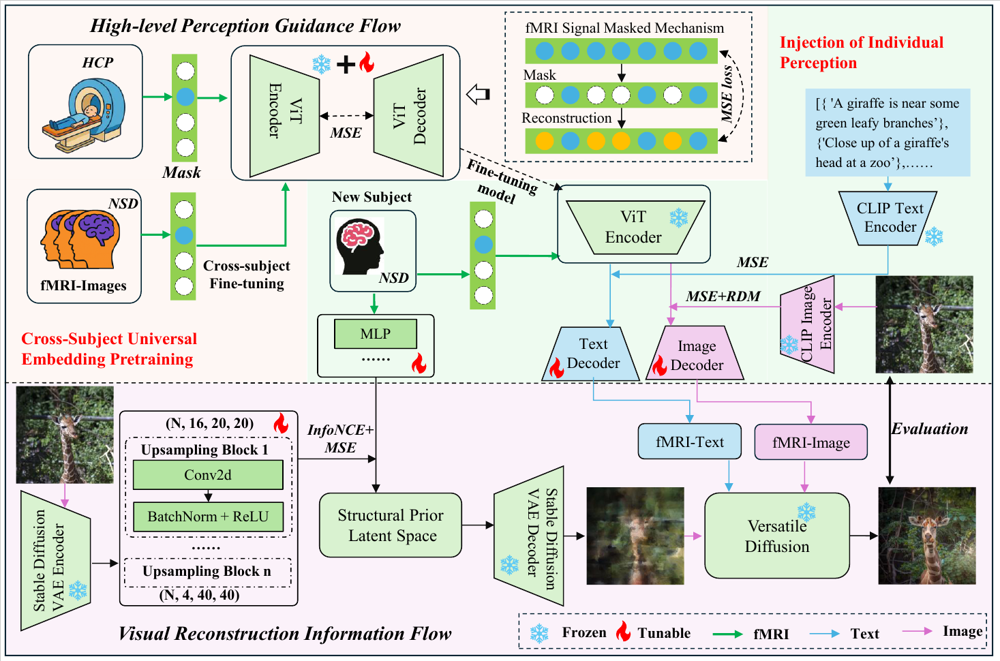

# SCRBrain

**From Shared Neural Priors to Individual Perception via Biomimetic Dual-Stream Visual Reconstruction**

SCRBrain is a biomimetic fMRI-to-image reconstruction framework for recovering complex natural scenes from human brain activity. The framework follows a progressive principle: learn shared neural priors from large-scale cross-subject fMRI data, inject subject-specific perceptual information, and reconstruct images through a dual-stream generative pathway that balances semantic faithfulness with structural fidelity.

This repository contains the research code used for the SCRBrain visual reconstruction pipeline, including masked fMRI pretraining, subject-level adaptation, fMRI-to-CLIP prediction, fMRI-to-latent prediction, ridge-based latent baselines, and Versatile Diffusion reconstruction.

## Highlights

- Establishes a **shared-priors-to-individual-perception** paradigm for fMRI visual reconstruction under limited paired fMRI-image data.
- Designs a **high-level perception guidance flow** that combines masked self-supervised fMRI pretraining with subject-specific semantic and geometric adaptation.
- Introduces a **visual reconstruction information flow** that predicts structured latent initializations to preserve global layout, object geometry, and color statistics.
- Integrates fMRI-derived structural, semantic, and geometric conditions into **Versatile Diffusion** for high-fidelity natural image reconstruction.
- Reports strong low-level reconstruction fidelity while maintaining competitive high-level semantic consistency on the NSD benchmark.

## Graphical Abstract



The original architecture figure is available as [Fig2-1.pdf](assets/Fig2-1.pdf).

**Visual summary.** SCRBrain first extracts cross-subject commonalities from large-scale fMRI signals through masked signal modeling. These shared neural priors are then adapted to the target subject to produce individualized semantic and geometric guidance. In parallel, a visual reconstruction stream maps fMRI activity to a structured latent initialization that anchors the reconstructed scene in the correct layout, shape, and color distribution. The two information flows are fused in a frozen Versatile Diffusion generator, yielding reconstructed images that are both structurally grounded and semantically meaningful.

**Suggested graphical abstract caption.**  
SCRBrain reconstructs natural scenes from fMRI by combining top-down high-level perceptual guidance with bottom-up structural latent initialization. Shared neural priors learned from multi-subject fMRI are adapted to each subject, while fMRI-predicted visual latents constrain the diffusion process to preserve scene layout and appearance.

## Abstract

Reconstructing visual stimuli from fMRI provides a computational window into human visual perception. Existing diffusion-based decoding methods can produce semantically plausible images, but they often emphasize category-level similarity while drifting in spatial layout, object geometry, color distribution, and local appearance. SCRBrain addresses this semantic-structural gap with a biomimetic dual-stream framework inspired by the organization of the human visual system.

The high-level perception guidance flow learns universal neural representations from large-scale multi-subject fMRI data and injects subject-specific perceptual information to generate semantic and geometric conditions. The visual reconstruction information flow maps fMRI signals into structured latent representations that provide explicit initialization for image generation. These complementary priors are integrated in Versatile Diffusion to reconstruct natural scenes with improved structural fidelity and stable semantic consistency.

## Framework

SCRBrain contains two complementary flows.

**1. High-level perception guidance flow**

This flow learns shared neural priors and adapts them to individual subjects.

- `stageA1_mbm_pretrain.py`: masked self-supervised pretraining on fMRI signals, designed to learn cross-subject contextual representations.
- `stageA2_mbm_finetune_nsd.py`: subject- or ROI-specific adaptation on NSD fMRI data by fine-tuning the last Transformer blocks.
- `pretrain2clip.py`: predicts CLIP-text conditions from fMRI for semantic guidance.
- `pretrain2latent.py`: predicts high-dimensional visual latent conditions from fMRI for geometric and appearance guidance.

**2. Visual reconstruction information flow**

This flow produces the structural initialization used by the final generator.

- `00MultiRidge_scrbrain.py`: GPU-accelerated Woodbury ridge regression for mapping fMRI signals to target feature spaces such as SD-VAE or VD latent features.
- `00versatile_diffusion_recon_scrbrain.py`: final reconstruction stage using fMRI-derived structural initialization and high-level CLIP conditions in Versatile Diffusion.
- `versatile_diffusion/`: local Versatile Diffusion implementation and inference utilities.
- `nsd_access/`: helper interface for accessing NSD stimulus metadata and images.

## Repository Structure

```text
SCRbrain/
|-- stageA1_mbm_pretrain.py                 # Masked fMRI pretraining on large-scale neural data
|-- stageA2_mbm_finetune_nsd.py             # NSD fine-tuning and subject/ROI adaptation
|-- pretrain2clip.py                        # fMRI-to-CLIP semantic condition prediction
|-- pretrain2latent.py                      # fMRI-to-visual-latent prediction
|-- 00MultiRidge_scrbrain.py                # Ridge and Woodbury ridge decoding baselines
|-- 00versatile_diffusion_recon_scrbrain.py # Final VD-based image reconstruction
|-- nsd_access/                             # NSD access utilities
`-- versatile_diffusion/                    # Versatile Diffusion backend
```

## Data and Model Preparation

SCRBrain uses public neuroimaging datasets and pretrained vision-language/generative models. They are not redistributed in this repository.

Required data and features:

- **HCP fMRI data** for masked self-supervised pretraining.
- **Natural Scenes Dataset (NSD)** fMRI responses and stimulus images for fine-tuning and evaluation. The NSD data used in this study are obtained from the official NSD website: <https://naturalscenesdataset.org/>.
- Subject-level fMRI arrays, typically stored as `*.npy` files for train/test splits.
- Extracted target features, including CLIP text tokens, CLIP vision tokens, SD-VAE latents, and VD latent features.
- Pretrained **CLIP**, **SD-VAE**, and **Versatile Diffusion** checkpoints.

The current scripts contain absolute paths from the original experiment environment. Before running, update paths such as:

- `root_path`
- `pretrain_mbm_path`
- `vd_model_path`
- NSD/HCP feature directories
- output directories under `decoded/` and `results/`

The training scripts also expect the project-level modules used in the original environment, including `config`, `dataset`, and `sc_mbm`.

## Environment

The experiments were implemented with PyTorch and evaluated on NVIDIA A5000 GPUs. A typical environment includes:

- Python 3.8+
- PyTorch with CUDA support
- NumPy, SciPy, scikit-learn
- timm
- himalaya
- pytorch-lightning
- torchvision
- Pillow
- wandb
- h5py
- tqdm

Additional requirements for the Versatile Diffusion backend are listed in:

```text
versatile_diffusion/requirement.txt
versatile_diffusion/requirement_colab.txt
```

## Typical Workflow

The following commands illustrate the intended pipeline. Please adjust paths, subjects, ROI settings, and GPU indices to match the local data layout.

### 1. Masked fMRI pretraining

```bash
python stageA1_mbm_pretrain.py \
  --root_path /path/to/project \
  --roi All_rois \
  --mask_ratio 0.75 \
  --batch_size 4 \
  --num_epoch 50 \
  --lr 5.3e-5 \
  --weight_decay 0.05 \
  --local_rank 0
```

### 2. Subject-level NSD fine-tuning

```bash
python stageA2_mbm_finetune_nsd.py \
  --root_path /path/to/project \
  --pretrain_mbm_path /path/to/pretrained/checkpoint.pth \
  --batch_size 4 \
  --num_epoch 50 \
  --mask_ratio 0.75 \
  --local_rank 0
```

### 3. Predict high-level semantic conditions

```bash
python pretrain2clip.py \
  --root_path /path/to/project \
  --subject subj01 \
  --ROI_NAME all \
  --batch_size 4 \
  --num_epoch 50 \
  --local_rank 0
```

### 4. Predict visual latent conditions

```bash
python pretrain2latent.py \
  --root_path /path/to/project \
  --subject subj01 \
  --batch_size 1 \
  --num_epoch 60 \
  --local_rank 0
```

### 5. Train ridge latent mappings

```bash
python 00MultiRidge_scrbrain.py \
  --subject subj01 \
  --target vdv_latent \
  --device cuda
```

### 6. Run Versatile Diffusion reconstruction

```bash
python 00versatile_diffusion_recon_scrbrain.py \
  --gpu 0 \
  --imgidx 0 982 \
  --vd_model_path /path/to/vd-four-flow-v1-0-fp16-deprecated.pth \
  --ddim_steps 50 \
  --strength 0.5 \
  --scale 7.5 \
  --blend_ratio 0.5
```

## Evaluation

SCRBrain follows common NSD visual reconstruction evaluation protocols and reports both low-level and high-level image metrics.

Low-level metrics:

- Pixel-wise correlation (PixCorr)
- Structural similarity index (SSIM)
- AlexNet layer-2 and layer-5 feature similarity

High-level metrics:

- Inception-v3 feature similarity
- CLIP ViT-L/14 feature similarity
- EfficientNet-B1 feature distance
- SwAV-ResNet-50 feature distance

In the manuscript experiments, SCRBrain reports strong low-level fidelity on NSD, including PixCorr `0.3944 +/- 0.0006`, SSIM `0.4356 +/- 0.0005`, AlexNet(2) `99.99%`, and AlexNet(5) `99.98% +/- 0.02%`, while maintaining competitive semantic metrics with Inception `92.92% +/- 1.17%`, CLIP `91.16% +/- 1.38%`, Eff-Net `0.6616 +/- 0.0181`, and SwAV `0.3463 +/- 0.0115`.

## Main Findings

The experiments support three central conclusions.

1. Shared fMRI pretraining improves both structural and semantic reconstruction compared with the same architecture trained without HCP pretraining.
2. Structural latent initialization is essential: semantic-only controls can generate category-related images but fail to recover stimulus-specific layout, pose, color distribution, and local appearance.
3. Subject-specific high-level guidance improves semantic fidelity by adapting shared neural priors to individual perceptual responses.

## Notes on Reproducibility

This repository is organized as research code corresponding to the SCRBrain manuscript. The scripts preserve the original experimental structure and therefore include hard-coded paths, subject lists, and feature naming conventions from the development environment. For clean reproduction, users should first standardize the local directory layout and then update the path variables in each script.

Large datasets and pretrained model weights should be downloaded from their official sources according to their respective licenses and usage agreements.

The NSD data should be requested and downloaded from the official Natural Scenes Dataset portal: <https://naturalscenesdataset.org/>. Users should follow the NSD data-use terms when preparing subject-level fMRI responses, stimulus images, and train/test splits.

## Citation

If this repository is useful for your research, please cite the SCRBrain manuscript:

```bibtex
@article{scrbrain2026,
  title  = {SCRBrain: From Shared Neural Priors to Individual Perception via Biomimetic Dual-Stream Visual Reconstruction},
  author = {Wang, Yaqi and Zhao, Xiaomeng and Chang, Xing and Zhang, Peng and Gui, Renzhou},
  year   = {2026}
}
```

## License

Please follow the license terms of the included third-party components, especially Versatile Diffusion, CLIP, NSD, HCP, and any pretrained model checkpoints used in downstream experiments.
